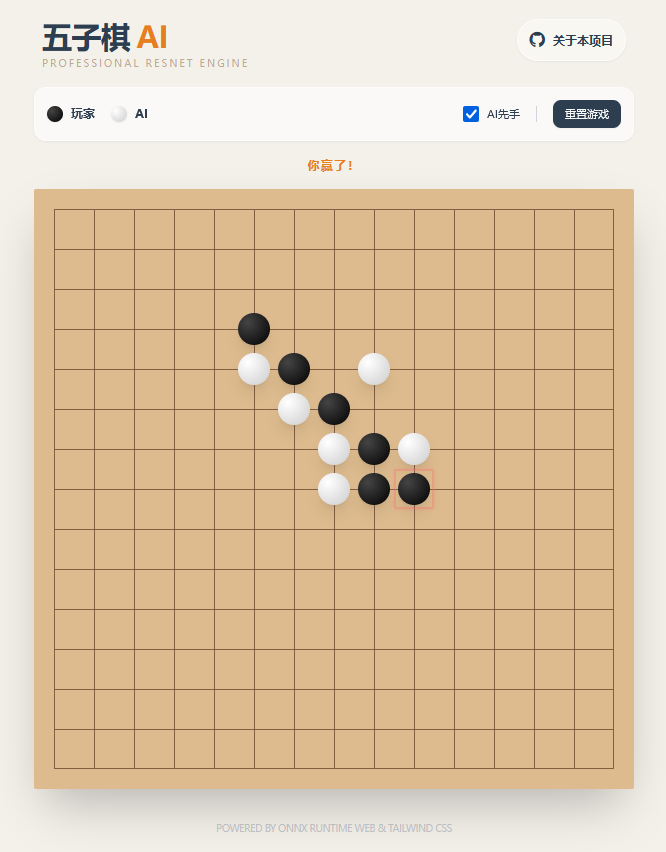

# 五子棋AI项目

这个项目是一个使用PyTorch实现的五子棋AI，其中Player1是主要训练目标，而Player2作为陪练模型帮助Player1提升。项目参考了AlphaZero的经典设计，利用深度学习技术，通过神经网络模型（基于ResNet残差网络的深度结构和强化学习）的训练机制来模拟玩家下棋的策略。

新版本（train_dy.py）引入了Kali-Hac Gomoku-AI架构作为对手代理进行对抗训练。系统支持Player1与多种开源AI实现进行同域博弈，并在训练过程中实现双向经验同步与联合优化。此外，模型具备鲁棒的跨尺度泛化性，原生支持在训练与推理阶段使用不一致的棋盘尺寸（推荐使用）。

## Web Demo

[人机对战](https://whyb.github.io/Gomoku-AI/webdemo/)

[](https://whyb.github.io/Gomoku-AI/webdemo/)

## 特点

- 使用 PyTorch 2.6.0+cu126 实现神经网络模型，支持 GPU 加速。
- 训练及推理验证均通过 PyTorch 内部机制自动检测并使用 GPU
- 使用残差网络（ResNet）作为核心架构，有效学习棋局特征。
- Player1 与 Player2 交替对战，Player1 作为主要训练目标
- 模型权重会定期保存，支持从上次的Checkpoint断点续训，确保训练过程的灵活性和稳定性。
- 训练使用 Adam 优化器，结合 交叉熵损失（用于评估落子策略）和 均方误差损失（用于评估局面价值），对模型进行联合优化。
- 支持自定义棋盘尺寸和胜利条件，轻松地将模型应用于不同规则的五子棋变体。
- 动态shape版本支持训练期间的棋盘与推理期间的棋盘尺寸不一致，模型具有泛化性。
- Player1 与 Kali-Hac Gomoku-AI 交替先手对战，Player1 作为训练目标。（新版本，动态模型版本）


## 依赖

确保你已经安装了以下依赖：

- Python 3.10+
- torch 2.6.0+cu126（支持 CUDA 12.6 的 GPU 版本）
- numpy 1.26.4

## 使用方法

### 安装环境

```shell
conda create --name gomoku-ai python=3.10
conda activate gomoku-ai
pip install -r requirements.txt
```

### 训练模型

运行以下命令开始训练模型，需指定棋盘尺寸和胜利条件：
```shell
# 8x8棋盘，连5子胜利，固定shape模型，最终只能导出8x8的推理模型
python train.py --board_size 8 --win_condition 5

# 15x15棋盘，连5子胜利，固定shape模型，最终只能导出15x15的推理模型
python train.py --board_size 15 --win_condition 5

# 训练使用8x8棋盘（也可是其他任意尺寸），连5子胜利，动态shape模型，最终能够使用export_onnx_dy.py导出任意尺寸的棋盘模型（推荐使用）
python train_dy.py --board_size 8 --win_condition 5
```

训练过程中，每 `config.SAVE_INTERVAL` 回合会保存一次 Player1 的模型权重，生成 `gobang_model_player1_*.pth`（静态shape模型） 或 `gobang_model_player1_dy_step_*.pth`（动态shape模型） 文件

训练结束后会生成 `gobang_best_model.pth`（静态shape模型）、`gobang_best_model_dy.pth`（动态shape模型） 作为最终权重文件，支持从该文件继续开始训练

### AI 奖励机制详解

五子棋的基本概念讲解：
注：棋子说明: X 表示玩家棋子，O 表示对手棋子，. 表示空位。
* 冲二 (Two in a row with one end blocked) 

  **含义**: 形成一个一端被堵住的二子连珠。价值最低，但能为后续发展奠定基础。
```
. . . . .
O X X . .
. . . . .
```
* 活二 (Live Two)

  **含义**: 形成一个两端都没有被堵住的二子连珠。这是最基础的进攻棋形，有较小的奖励。
```
. . . . .
. . X X .
. . . . .
```

* 冲三 (Three in a row with one end blocked)

  **含义**: 形成一个一端被堵住的三子连珠。需要两步才能成五，但仍然有进攻价值。
```
. . . . . .
. O X X X .
. . . . . .
```

* 活三 (Live Three)

  **含义**: 形成一个两端都没有被堵住的三子连珠。可以发展为活四或冲四，是重要的潜在威胁。
```
. . . . . . .
. . . X X X .
. . . . . . .
```

* 冲四 (Four in a row with one end blocked)

  **含义**: 形成一个一端被堵住的四子连珠。只需再下一子即可成五，是重要的进攻棋形。
```
. . . . . . . . .
. . O X X X X . .
. . . . . . . . .
```

* 活四 (Live Four)

  **含义**: 形成一个两端都没有被堵住的四子连珠。这是一个必胜棋形，因为对手无法同时防守两端的落子点。
```
. . . . . . . . .
. . . X X X X . .
. . . . . . . . .
```

* 双活三 (Double Live Three)

  **含义**: 一次落子同时形成了两个活三。这种棋形通常会形成一个必胜局面，因为对手无法同时防守两个方向的进攻。
```
. . . . . . .
. . . . . . .
. . X . X X .
. . . X . . .
. . . X . . .
. . . . . . .
```

* 冲四活三 (Four-in-a-row and Live Three)

  **含义**: 一次落子同时形成一个冲四和一个活三。这是五子棋中非常强大的组合，奖励值极高，通常意味着下一步即可获胜。
```
. . . . . . . .
. . . . . . . .
. . X . . . . .
. O X X X X . .
. . X . . . . .
. . . . . . . .
```

* 双冲四 (Double Four-in-a-row)

  **含义**: 一次落子同时形成两个冲四。这是必杀，奖励值极高，意味着下一步即可获胜。
```
. . . . . . . .
. . . . . X . .
. . . . X . . .
. O X X X X . .
. . X . . . . .
. O . . . . . .
. . . . . . . .
```


### 模型架构与输入输出

本项目中的 AI 模型 `GomokuNetV3` 采用了融合 **残差网络 (ResNet)** 和 **Transformer** 的混合架构，旨在同时捕捉棋盘的局部特征和全局依赖关系。

模型的输入和输出设计如下：

#### 1. 模型输入 (Input)

-   **含义**: 模型的输入是当前五子棋局面的表示。为了让模型能区分不同玩家的棋子，我们使用多通道表示方法。
-   **形状 (Shape)**: `(batch_size, 2, board_size, board_size)`
    -   **`batch_size`**: 表示一次性处理的棋局数量。通常在训练时大于1，预测时为1。
    -   **`2`**: 输入的通道数。
        -   **通道 0**: 玩家1（当前落子方）的棋盘状态。如果该位置有玩家1的棋子，值为1，否则为0。
        -   **通道 1**: 玩家2（对手方）的棋盘状态。如果该位置有玩家2的棋子，值为1，否则为0。
    -   **`board_size`**: 棋盘的边长。例如，对于5x5的棋盘，`board_size` 为5。

---

#### 2. 模型输出 - 策略对数 (policy_logits)

-   **含义**: 这是一个预测每个棋盘位置的落子“可能性”的原始分数（logits）。这些分数越高，代表模型认为在这个位置落子的选择越好。
-   **作用**: 在模型内部，这些 logits 通常会通过 **Softmax** 函数转换为概率分布，用于指导模型选择下一步的落子位置。在实际应用中，我们通常会选择 logits 最高的那个有效落子点。
-   **形状 (Shape)**: `(batch_size, board_size * board_size)`
    -   **`batch_size`**: 与输入一致。
    -   **`board_size * board_size`**: 一个一维向量，长度等于棋盘的总格子数。对于5x5的棋盘，这个长度为25。每个元素对应棋盘上一个格子的 logits 值。
-   **值范围**: 这是一个原始分数，没有特定的值范围，可以是任意实数（正负均可）。

---

#### 3. 模型输出 - 价值输出 (value_output)

-   **含义**: 这是一个预测当前局面**胜率**的标量值。
-   **作用**: 价值头用来评估当前棋盘局面的优劣。如果这个值接近1，表明模型认为当前玩家有很高的胜率；如果接近-1，表明模型认为对手有很高的胜率；如果接近0，则局面可能处于均势。
-   **形状 (Shape)**: `(batch_size)`
    -   **`batch_size`**: 与输入一致。每个棋局会对应一个价值预测。
-   **值范围**: 经过 `Tanh` 激活函数处理，因此其值范围被限制在 **$[-1, 1]$** 之间。
    -   **$1$**: 绝对胜利。
    -   **$-1$**: 绝对失败。
    -   **$0$**: 局面均势。

通过这两个输出，模型可以同时进行**决策 (policy)** 和**局面评估 (value)**，参考的是 AlphaGo 等深度强化学习模型中非常经典的架构。

### 使用GPU

代码会通过 PyTorch 自动检测并使用可用的 GPU，无需手动配置：

* 若系统存在兼容的 NVIDIA GPU 且安装了对应 CUDA 版本，会自动启用 GPU 加速
* 若无 GPU，会自动 fallback 到 CPU 模式运行


### 转换ONNX

您可以将训练好的模型转换为 ONNX 格式 和 torchscript 模型（需指定棋盘尺寸和胜利条件）：

#### 静态shape模型
```shell
# 基础用法（8x8棋盘，连5子胜利）
python export_onnx.py gobang_best_model.pth --board_size 8 --win_condition 5

# 自定义输出路径
python export_onnx.py gobang_best_model.pth \
  --board_size 8 --win_condition 5 \
  --onnx_path ./webdemo/model_bs8_win5.onnx

```
#### 动态shape模型（推荐）
```shell
# 基础用法（15x15棋盘，连5子胜利）
python export_onnx_dy.py gobang_best_model_dy.pth --board_size 15 --win_condition 5

# 自定义输出路径
python export_onnx_dy.py gobang_best_model_dy.pth \
  --board_size 15 --win_condition 5 \
  --onnx_path ./webdemo/model_bs15_win5.onnx

```
导出onnx执行成功后，会在目录中产生 `./model_*x*.pt`、`./webdemo/model_*x*.onnx` 命名的文件，后续就可以使用webdemo/下面的人机对战程序进行测试。


## 欢迎贡献

欢迎您贡献代码！如果你有任何改进建议或发现了问题，请提交Pull Request或者直接在本仓库创建issue。
