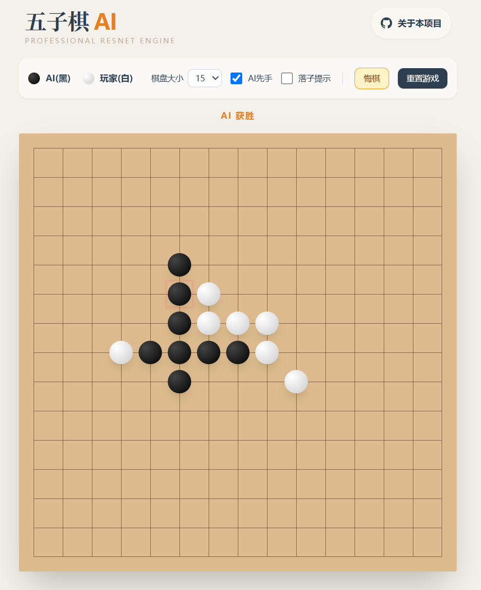

# 五子棋AI项目

这个项目是一个使用PyTorch实现的五子棋AI，其中Player1是主要训练目标，而Player2作为陪练模型帮助Player1提升。项目参考了AlphaZero的经典设计，利用深度学习技术，通过神经网络模型（基于ResNet残差网络的深度结构和强化学习）的训练机制来模拟玩家下棋的策略。

新版本（train_dy.py）引入了Kali-Hac Gomoku-AI架构作为对手代理进行对抗训练。系统支持Player1与多种开源AI实现进行同域博弈，并在训练过程中实现双向经验同步与联合优化。此外，模型具备鲁棒的跨尺度泛化性，原生支持在训练与推理阶段使用不一致的棋盘尺寸（推荐使用）。

## Web Demo

[人机对战](https://whyb.github.io/Gomoku-AI/webdemo/)

[](https://whyb.github.io/Gomoku-AI/webdemo/)

## 五子棋规则

本项目采用**无禁手五子棋 (Free-style Gomoku)** 规则：

- **黑方 (P1) 先手**，第一手必须落子**天元**（棋盘正中心）
- **白方 (P2) 后手**，无落子限制
- 任意方向**连续 5 子**即获胜
- **双方均无禁手**：黑方也可通过双活三、双冲四、长连（≥6 子）等方式取胜
- 棋盘默认 15×15，支持自定义尺寸

> 与职业连珠 (Renju) 不同，本项目不限制黑方的三三、四四、长连等禁手，规则更简洁通用。

## 特点

- 使用 PyTorch 2.6.0+cu126 实现神经网络模型，支持 GPU 加速。
- 训练及推理验证均通过 PyTorch 内部机制自动检测并使用 GPU
- 使用残差网络（ResNet）作为核心架构，有效学习棋局特征。
- Player1 与 Player2 交替对战，Player1 作为主要训练目标
- 模型权重会定期保存，支持从上次的Checkpoint断点续训，确保训练过程的灵活性和稳定性。
- 训练使用 Adam 优化器，结合 交叉熵损失（用于评估落子策略）和 均方误差损失（用于评估局面价值），对模型进行联合优化。
- 支持自定义棋盘尺寸和胜利条件，轻松地将模型应用于不同规则的五子棋变体。
- 动态shape版本支持训练期间的棋盘与推理期间的棋盘尺寸不一致，模型具有泛化性。
- Player1 与 Kali-Hac Gomoku-AI 交替先手对战，Player1 作为训练目标。（新版本，动态模型版本）
- AlphaZero 风格训练：MCTS 自博弈 + 对手池 + D4 对称增强 + SE-ResNet 架构，模型持续进化
- 两阶段训练（推荐）：先通过传统 AI 教师 (Kali-Hac) 知识蒸馏快速达到大师级审局，再 MCTS 自博弈微调超越教师


## 依赖

确保你已经安装了以下依赖：

- Python 3.10+
- torch 2.6.0+cu126（支持 CUDA 12.6 的 GPU 版本）
- numpy 1.26.4

## 使用方法

### 安装环境

```shell
conda create --name gomoku-ai python=3.10
conda activate gomoku-ai
pip install -r requirements.txt
```

### 训练模型

运行以下命令开始训练模型，需指定棋盘尺寸和胜利条件：

#### 老版本训练（不推荐）
<details>
  <summary>老版本训练命令（不推荐）点击此处展开</summary>

```shell
# 8x8棋盘，连5子胜利，固定shape模型，最终只能导出8x8的推理模型
python train.py --board_size 8 --win_condition 5

# 15x15棋盘，连5子胜利，固定shape模型，最终只能导出15x15的推理模型
python train.py --board_size 15 --win_condition 5

# 训练使用8x8棋盘（也可是其他任意尺寸），连5子胜利，动态shape模型，最终能够使用export_onnx_dy.py导出任意尺寸的棋盘模型（推荐使用）
python train_dy.py --board_size 8 --win_condition 5
```

训练过程中，每 `config.SAVE_INTERVAL` 回合会保存一次 Player1 的模型权重，生成 `gobang_model_player1_*.pth`（静态shape模型） 或 `gobang_model_player1_dy_step_*.pth`（动态shape模型） 文件

训练结束后会生成 `gobang_best_model.pth`（静态shape模型）、`gobang_best_model_dy.pth`（动态shape模型） 作为最终权重文件，支持从该文件继续开始训练


</details>


#### AlphaZero 风格训练（推荐）

基于 AlphaZero 的训练流水线，通过 **MCTS 自博弈** 替代固定对手训练，能够持续进化：

```shell
# 标准模型 15×15 棋盘训练（推荐正式训练）
python train_alphazero.py --board_size 15 --num_simulations 400 --model standard --fp16

# 小模型 15×15 棋盘训练（快速实验）
python train_alphazero.py --board_size 15 --num_simulations 400 --model small --fp16

```

### 训练可视化（TensorBoard）

`train_alphazero.py` 默认开启 TensorBoard 日志记录（蒸馏阶段与 MCTS 自博弈阶段均支持），训练过程中会将 loss、Top-K 准确率、Elo 评分、吞吐速度等指标写入 `runs/` 目录：

```shell
tensorboard --logdir runs
```

浏览器打开 `http://localhost:6006` 即可查看训练曲线。

常用参数：

- `--log_dir`：日志目录（默认 `runs`）
- `--no_tensorboard`：禁用日志记录

### 两阶段训练（推荐）

直接从随机初始化开始 MCTS 强化学习收敛很慢（RL 稀疏奖励），本项目采用**两阶段训练**：先用传统 AI 教师快速"模仿大师"（知识蒸馏），再通过自博弈"超越教师"（MCTS 微调）：

```
阶段 1: 蒸馏 (--distill)              阶段 2: MCTS 微调 (正常训练)
┌───────────────────────┐              ┌──────────────────────┐
│ 教师 AI (Kali-Hac)    │  加载权重     │ MCTS + 自博弈         │
│   ↓ 自我对弈           │ ──────────→  │   ↓                  │
│ (state, π_teacher, z) │  自动衔接     │ 强化学习微调          │
│   ↓                   │              │   ↓                  │
│ KL 散度 + MSE 训练     │              │ 超越教师             │
└───────────────────────┘              └──────────────────────┘
```

#### 阶段 1：知识蒸馏 — 快速模仿大师

**目的**：让随机初始化的网络迅速学到教师 AI 的审局能力（"形似"）。

| 特性 | 说明 |
|------|------|
| 数据来源 | 教师 AI (Kali-Hac) 自我对弈，非 MCTS |
| 损失函数 | `L = KL(teacher_soft \|\| student_soft) × T² + λ × MSE(v, z)` |
| 温度 T | 默认 3.0（`--distill_temperature`），教师评分经 log 压缩 + 温度缩放 → 软化概率分布 |
| 价值头权重 | 默认 0.5（`--distill_value_weight`），教师无精确估值，训练聚焦策略匹配 |
| 随机开局 | 默认 20%（`--distill_random_frac`），先随机走 4~12 步，强制教师处理"烂摊子"局面 |
| 数据效率 | 纯监督学习，收敛极快（5 万局可达 Top-1 80%+） |
| 推荐局数 | 10×10: 5 万局；15×15: 2~3 万局；5×5: 1 万局 |

#### 阶段 2：MCTS 微调 — 超越教师

关闭 `--distill` 后正常训练会**自动加载蒸馏权重**作为初始权重（优先 `*_distill_best.pth`，其次 `*_distill.pth`），进行标准 AlphaZero MCTS 自博弈微调，突破教师水平上限。

```shell
# 第一阶段：蒸馏（15×15，2 万局，约 1-3 小时）
python train_alphazero.py --board_size 15 --model standard --distill --distill_games 20000

# 第二阶段：MCTS 微调（自动加载蒸馏权重）
python train_alphazero.py --board_size 15 --model standard --num_simulations 400
```

#### 为什么需要两阶段？

| 维度 | 纯蒸馏 | 纯 MCTS（随机初始化） | 蒸馏 → MCTS |
|------|--------|----------------------|-------------|
| 训练速度 | 快（监督学习） | 慢（RL 稀疏奖励） | 快 → 慢 |
| 棋力上限 | = 教师水平 | 可超越教师 | **可超越教师** |
| 泛化能力 | 差（怕"无理手"） | 强（探索驱动） | **强** |
| 状态分布 | 窄（教师风格） | 宽（MCTS 探索） | 窄 → 宽 |

> **分布偏移 (Distribution Shift)**：蒸馏数据全部来自教师自我对弈，状态空间窄，遇到不按教师套路走的对手（如乱下、MCTS 怪异走法）容易犯错。`--distill_random_frac` 只能部分缓解，根本方案是 MCTS 微调——模型通过自博弈探索海量新状态。
>
> **蒸馏崩塌防护（已实现）**：最佳模型追踪（Top1 每提升 ≥0.5% 保存 `*_distill_best.pth`）、三级崩溃检测（Top1 归零 / 相对最佳暴跌 70% / Loss 暴增 3×）、自动恢复最佳 checkpoint、连续 20 次评估无提升自动早停。

### 训练量预估（15×15 棋盘，400 MCTS 模拟/步）

| 场景 | 小模型 `--model small` | 标准模型 `--model standard` | 预期水平 |
| :--- | :--- | :--- | :--- |
| 🟢 入门 | 5,000–10,000 | — | 能稳定击败随机走子 |
| 🟡 业余 | 30,000–50,000 | ~50,000 | 掌握活三、冲四等基本战术 |
| 🟠 强业余 | 80,000–100,000 | 150,000–200,000 | 战术意识成熟，击败大多数人类；**小模型接近容量上限** |
| 🔴 高手 | >300,000（不推荐） | 300,000–500,000 | 战术判断精准，攻守平衡 |
| 🏆 超人类 | 达不到 | 1,000,000+ | 接近该架构的理论上限 |

> **建议**：15×15 棋盘推荐使用 `--model standard`（128 通道、10 层 SE-ResNet、~3M 参数）。小模型 (~460K 参数) 受限于容量，在 15×15 棋盘上无论训练多少盘都难以突破强业余水平。

#### 训练产出文件

训练过程中会自动保存以下文件（以标准模型为例）：

| 文件 | 说明 |
|------|------|
| `alpaz_standard_15x15_model.pth` | 纯模型权重（用于导出 ONNX） |
| `alpaz_standard_15x15_checkpoint.pth` | 完整断点（含优化器/调度器状态，可续训） |
| `alpaz_standard_15x15_opponent_pool.pth` | 对手池（含历史模型快照） |
| `alpaz_standard_15x15_elo.json` | Elo 评分记录 |
| `alpaz_standard_15x15_distill.pth` | 蒸馏最终权重（关闭 `--distill` 后自动加载，MCTS 微调起点） |
| `alpaz_standard_15x15_distill_best.pth` | 蒸馏最佳权重（Top1 新高时保存，崩溃检测时自动恢复） |
| `alpaz_standard_15x15_best.pth` | MCTS 微调阶段最佳模型（Elo 新高时保存） |

与传统训练方式相比，AlphaZero 流水线具备以下特性：

- **MCTS（蒙特卡洛树搜索）**：使用 PUCT 选择策略，每步模拟 200~800 次，生成高质量的落子策略 π
- **自博弈训练**：模型与自身对弈生成训练数据，不再依赖固定对手
- **对手池（Opponent Pool）**：自动保存历史模型快照，训练时 50% 概率与历史版本对弈，避免灾难性遗忘
- **D4 对称增强**：每次经验自动应用 8 种旋转/翻转变换，数据量放大 8 倍
- **Elo 评分系统**：追踪模型实力变化，自动评估新旧版本
- **温度退火**：前期高温度鼓励探索，后期低温度选择最优落子
- **完整断点续训**：自动保存模型、优化器、调度器、训练步数、总对局数等全部状态

AlphaZero 版本使用 **SE-ResNet（Squeeze-Excitation Residual Network）**，在标准残差块中加入通道注意力机制：

| 模型 | 通道数 | 层数 | 参数量 | 适用场景 |
|------|--------|------|--------|----------|
| GomokuNetAlphaZeroSmall | 64 | 6 | ~460K | 快速实验、小棋盘 |
| GomokuNetAlphaZero | 128 | 10 | ~3M | 正式训练、大棋盘 |

损失函数与传统 `CE × reward` 不同，使用三个损失的加权和：

```
L = (z - v)² - π^T · log(p) + c · ||θ||²
    ─────   ─────────────   ───────
    价值MSE   策略交叉熵     L2正则
```

- `z`：游戏最终结果（+1赢 / -1输 / 0平），`v`：模型预测的价值
- `π`：MCTS 搜索得到的策略分布，`p`：模型预测的策略概率

训练日志示例：
```
Game  42 | 127 moves | winner=Black | opponent=history | 896 samples | 4.2s
  MCTS: 2.1s | NN: 1.5s | symm: 0.4s | avg: 30 sims/s
```
- `opponent=history`：对手来自历史模型池；`opponent=self`：对手是当前最新模型
- `samples`：本局生成的训练样本数（已含对称增强）

### AI 奖励机制详解

五子棋的基本概念讲解：
注：棋子说明: X 表示玩家棋子，O 表示对手棋子，. 表示空位。
* 冲二 (Two in a row with one end blocked) 

  **含义**: 形成一个一端被堵住的二子连珠。价值最低，但能为后续发展奠定基础。
```
. . . . .
O X X . .
. . . . .
```
* 活二 (Live Two)

  **含义**: 形成一个两端都没有被堵住的二子连珠。这是最基础的进攻棋形，有较小的奖励。
```
. . . . .
. . X X .
. . . . .
```

* 冲三 (Three in a row with one end blocked)

  **含义**: 形成一个一端被堵住的三子连珠。需要两步才能成五，但仍然有进攻价值。
```
. . . . . .
. O X X X .
. . . . . .
```

* 活三 (Live Three)

  **含义**: 形成一个两端都没有被堵住的三子连珠。可以发展为活四或冲四，是重要的潜在威胁。
```
. . . . . . .
. . . X X X .
. . . . . . .
```

* 冲四 (Four in a row with one end blocked)

  **含义**: 形成一个一端被堵住的四子连珠。只需再下一子即可成五，是重要的进攻棋形。
```
. . . . . . . . .
. . O X X X X . .
. . . . . . . . .
```

* 活四 (Live Four)

  **含义**: 形成一个两端都没有被堵住的四子连珠。这是一个必胜棋形，因为对手无法同时防守两端的落子点。
```
. . . . . . . . .
. . . X X X X . .
. . . . . . . . .
```

* 双活三 (Double Live Three)

  **含义**: 一次落子同时形成了两个活三。这种棋形通常会形成一个必胜局面，因为对手无法同时防守两个方向的进攻。
```
. . . . . . .
. . . . . . .
. . X . X X .
. . . X . . .
. . . X . . .
. . . . . . .
```

* 冲四活三 (Four-in-a-row and Live Three)

  **含义**: 一次落子同时形成一个冲四和一个活三。这是五子棋中非常强大的组合，奖励值极高，通常意味着下一步即可获胜。
```
. . . . . . . .
. . . . . . . .
. . X . . . . .
. O X X X X . .
. . X . . . . .
. . . . . . . .
```

* 双冲四 (Double Four-in-a-row)

  **含义**: 一次落子同时形成两个冲四。这是必杀，奖励值极高，意味着下一步即可获胜。
```
. . . . . . . .
. . . . . X . .
. . . . X . . .
. O X X X X . .
. . X . . . . .
. O . . . . . .
. . . . . . . .
```

更多基础知识详见： [五子棋术语](https://baike.baidu.com/item/%E4%BA%94%E5%AD%90%E6%A3%8B%E6%9C%AF%E8%AF%AD/11009079)


### 模型验证（val_az.py）

对已训练的 AlphaZero 模型进行验证，使用 `val_az.py`。输出两行核心结论：始终只报**验证模型**的胜率与平局率（按先手/后手分组），自对弈模式下显示为"验证模型1/验证模型2"。

```shell
# 模型自对弈（默认 target=self，P1/P2 均为同一模型）
python val_az.py --board_size 15 --model standard --model_path alpaz_standard_15x15_best.pth --target self

# 与 Kali-Hac 教师对弈（验证模型执黑=P1，教师执白=P2）
python val_az.py --board_size 15 --model standard --model_path alpaz_standard_15x15_best.pth --target teacher
```

常用参数：

- `--target self|teacher`：自对弈（默认）或与教师对弈
- `--model small|standard`：模型大小，需与训练时一致
- `--model_path`：支持纯权重（`*_model.pth`、`*_best.pth`、`*_distill.pth`）和完整 checkpoint（自动识别其中的 `model_state_dict`）
- `--total_rounds`：验证局数（默认 200）
- `--epsilon`：模型落子随机探索率，默认 0（纯贪心，评估推荐）
- `--seed N`：固定随机种子，结果可完全复现


### 模型架构与输入输出

本项目推荐使用的 AI 模型是 AlphaZero 风格的双头网络 `GomokuNetAlphaZero`（标准版）和 `GomokuNetAlphaZeroSmall`（小模型，快速实验）。**两者都是残差模型**，具体为 **SE-ResNet（Squeeze-Excitation Residual Network）**：每个残差块由两层 3×3 卷积 + 批归一化 + SE 通道注意力组成，并通过 `out + residual` 残差（跳跃）连接叠加。与老版 `GomokuNetV3` 不同，新版**不使用 Transformer**，而是纯卷积结构，全卷积 + 全局平均池化使其原生支持任意棋盘大小。

| 模型 | 通道数 | SE 残差块数 | 参数量 | 适用场景 |
|------|--------|-------------|--------|----------|
| GomokuNetAlphaZeroSmall | 64 | 6 | ~460K | 快速实验、小棋盘 |
| GomokuNetAlphaZero | 128 | 10 | ~3M | 正式训练、大棋盘 |

网络结构：

```
输入 (B, 2, H, W)
  ↓
Stem: Conv3×3(2→C) → BN → ReLU
  ↓
Body: N × SEResBlock(Conv3×3→BN→ReLU→Conv3×3→BN→SE→残差相加→ReLU)
  ↓
┌────────────────┬────────────────┐
│ Policy Head    │ Value Head     │
│ Conv1×1→32     │ Conv1×1→32     │
│ BN → ReLU      │ BN → ReLU      │
│ Conv1×1→1      │ AvgPool → FC   │
│ → (B, H×W)     │ → (B, 1)       │
└────────────────┴────────────────┘
```

模型的输入和输出设计如下：

#### 1. 模型输入 (Input)

-   **含义**: 模型的输入是当前五子棋局面的表示。为了让模型能区分不同玩家的棋子，我们使用多通道表示方法。
-   **形状 (Shape)**: `(batch_size, 2, board_size, board_size)`
    -   **`batch_size`**: 表示一次性处理的棋局数量。通常在训练时大于1，预测时为1。
    -   **`2`**: 输入的通道数，采用**当前玩家视角**（视角对称，同一套权重对执黑/执白通用）。
        -   **通道 0**: 当前落子方棋子的棋盘状态。该位置有当前方棋子为1，否则为0。
        -   **通道 1**: 对手方棋子的棋盘状态。该位置有对手棋子为1，否则为0。
    -   **`board_size`**: 棋盘的边长。模型全卷积、无固定尺寸层，支持任意棋盘大小（例如5x5的棋盘，`board_size` 为5）。

---

#### 2. 模型输出 - 策略对数 (policy_logits)

-   **含义**: 这是一个预测每个棋盘位置的落子“可能性”的原始分数（logits）。这些分数越高，代表模型认为在这个位置落子的选择越好。
-   **作用**: 在模型内部，这些 logits 通常会通过 **Softmax** 函数转换为概率分布，用于指导模型选择下一步的落子位置。在实际应用中，我们通常会选择 logits 最高的那个有效落子点。
-   **形状 (Shape)**: `(batch_size, board_size * board_size)`
    -   **`batch_size`**: 与输入一致。
    -   **`board_size * board_size`**: 一个一维向量，长度等于棋盘的总格子数。对于5x5的棋盘，这个长度为25。每个元素对应棋盘上一个格子的 logits 值。
-   **值范围**: 这是一个原始分数，没有特定的值范围，可以是任意实数（正负均可）。

---

#### 3. 模型输出 - 价值输出 (value_output)

-   **含义**: 这是一个预测当前局面**胜率**的标量值。
-   **作用**: 价值头用来评估当前棋盘局面的优劣。如果这个值接近1，表明模型认为当前玩家有很高的胜率；如果接近-1，表明模型认为对手有很高的胜率；如果接近0，则局面可能处于均势。
-   **形状 (Shape)**: `(batch_size)`
    -   **`batch_size`**: 与输入一致。每个棋局会对应一个价值预测。
    -   **视角**: 从**当前落子方**的视角评估（价值输出形状为 `(batch_size,)`，代码中经 `squeeze(-1)` 去掉尾部维度）。
-   **值范围**: 经过 `Tanh` 激活函数处理，因此其值范围被限制在 **$[-1, 1]$** 之间。
    -   **$1$**: 当前方绝对胜利。
    -   **$-1$**: 当前方绝对失败。
    -   **$0$**: 局面均势。

通过策略头和价值头两个输出，模型可以同时进行**决策 (policy)** 和**局面评估 (value)**，参考的是 AlphaGo / AlphaZero 等深度强化学习模型中非常经典的双头架构。

### 使用GPU

代码会通过 PyTorch 自动检测并使用可用的 GPU，无需手动配置：

* 若系统存在兼容的 NVIDIA GPU 且安装了对应 CUDA 版本，会自动启用 GPU 加速
* 如果是AMD GPU也可以使用ROCm版的Pytorch，代码不用修改一行
* 若无 GPU，会自动 fallback 到 CPU 模式运行


### 转换ONNX

您可以将训练好的模型转换为 ONNX 格式 和 torchscript 模型（需指定棋盘尺寸和胜利条件）：

#### 静态shape模型（老版本，不推荐）

<details>
  <summary>点击此处展开</summary>

```shell
# 基础用法（8x8棋盘，连5子胜利）
python export_onnx.py gobang_best_model.pth --board_size 8 --win_condition 5

# 自定义输出路径
python export_onnx.py gobang_best_model.pth --board_size 8 --win_condition 5 --onnx_path ./webdemo/model_bs8_win5.onnx
```

</details>


#### 动态shape模型（老版本，不推荐）

<details>
  <summary>点击此处展开</summary>

```shell
# 基础用法（15x15棋盘，连5子胜利）
python export_onnx_dy.py gobang_best_model_dy.pth --board_size 15 --win_condition 5

# 自定义输出路径
python export_onnx_dy.py gobang_best_model_dy.pth --board_size 15 --onnx_path ./webdemo/model_bs15_win5.onnx
```

</details>

#### AlphaZero 模型导出（推荐）
```shell
# 导出 Standard 模型
python export_onnx_az.py alpaz_standard_15x15_model.pth --board_size 15 --model standard

# 导出 Small 模型
python export_onnx_az.py alpaz_small_15x15_model.pth --board_size 15 --model small

# 自定义输出路径（供 Web Demo 使用）
python export_onnx_az.py alpaz_standard_15x15_model.pth --board_size 15 --model standard --onnx_path ./webdemo/model_bs15_win5.onnx
```

导出onnx执行成功后，会在目录中产生 `gobang_az_*_*x*.onnx` 和 `gobang_az_*_*x*.pt` 文件，后续就可以使用webdemo/下面的人机对战程序进行测试。

## Projects using Gomoku-AI
* [基于alphazero的TW对弈插件](https://www.bilibili.com/video/BV1V5cozPELG/)

## 欢迎贡献

欢迎您贡献代码！如果你有任何改进建议或发现了问题，请提交Pull Request或者直接在本仓库创建issue。
